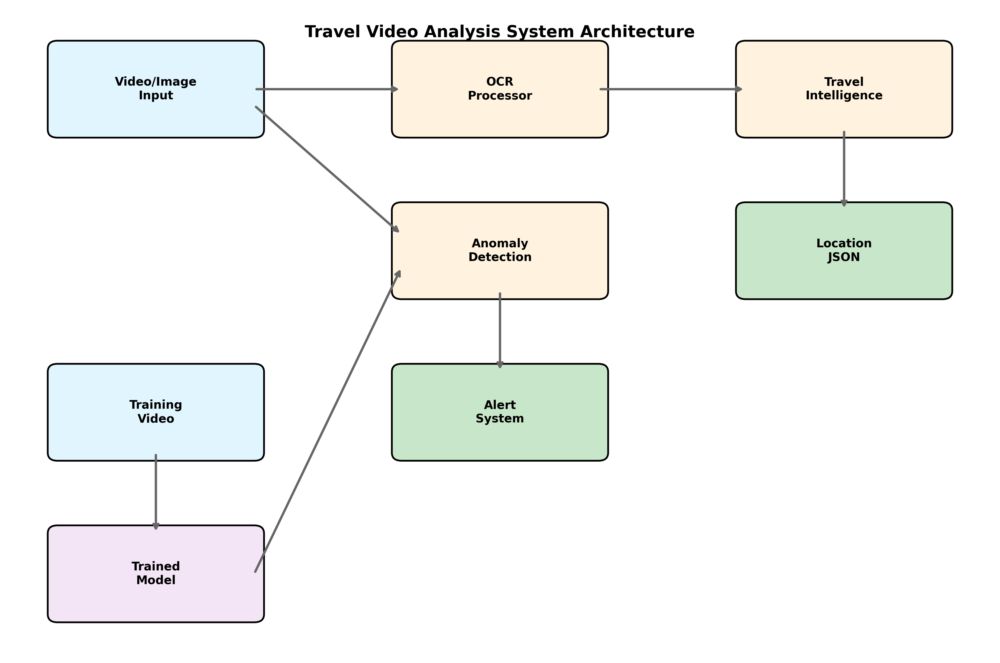

# Travel Video Analysis Tool

Extract travel information from videos/images using OCR + GPT-4, plus anomaly detection for surveillance.



## Quick Start

```bash
# Docker (Recommended)
git clone https://github.com/s2010/journeyspotter.git
cd journeyspotter && docker-compose up

# Local
pip install -r requirements.txt
export OPENAI_API_KEY='your-key'
```

## Usage

**Travel Analysis:**
```bash
python journey_spotter.py --analyze-travel video.mp4 --output-json results.json
```

**Anomaly Detection:**
```bash
python journey_spotter.py --record --train
python journey_spotter.py --input video.mp4 --detect-anomalies
```

## Output Example

```json
{
  "locations": [
    {"location": "Tokyo", "country": "Japan", "type": "capital city"}
  ],
  "summary": "Journey from Tokyo to Kyoto via Shinkansen"
}
```

## Requirements

- Python 3.9+, OpenAI API key
- PyTorch, OpenCV, EasyOCR/Tesseract
- Docker (optional)

## License

MIT 