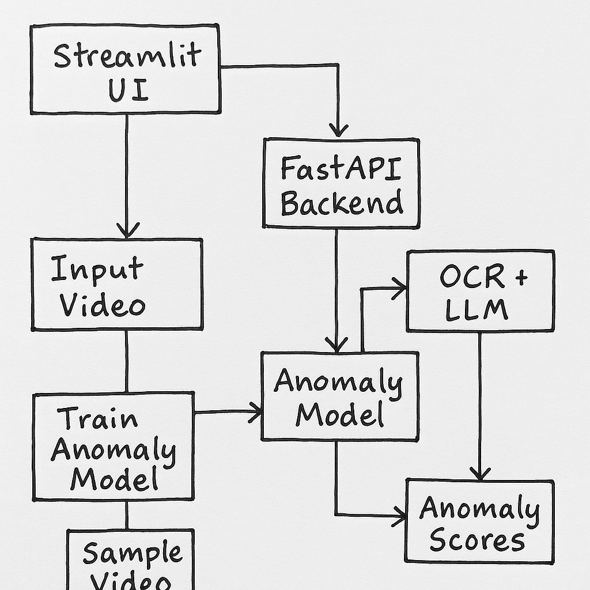

# Advanced Video Analysis with Anomaly Detection

Extract information from videos/images using OCR + Llama 3.1 8B model with real-time anomaly detection.

## Application Flow



*Complete pipeline: Video/Image Input → OCR Processing → LLM Analysis → Anomaly Detection → Results Visualization*

## Features

- **OCR Analysis**: EasyOCR/Tesseract text extraction
- **LLM Intelligence**: Llama 3.1 8B content analysis
- **Anomaly Detection**: ResNet-18 + IsolationForest two-stage model
- **Interactive UI**: Streamlit with real-time visualization
- **Production Ready**: Docker, modular architecture, comprehensive tests
- Llama 3.1 8B model

## Quick Start

```bash
docker build -t journeyspotter .
GROQ_API_KEY=your_groq_api_key_here docker run -p 8000:8000 -e GROQ_API_KEY journeyspotter
```

## Demo UI

https://anomaly.alrumahi.site